# Obsidian 图片助手插件功能整合设计

## 1. 设计概述

### 1.1 背景与需求

用户当前使用 obsidian-image-converter 插件进行图片的本地处理(格式转换、尺寸调整、题注渲染),并希望迁移到使用 obsidian-image-auto-upload-plugin 支持的图床服务。然而,这两个插件同时使用时产生冲突,且 upload 插件不支持 converter 插件的关键功能:

1. 非破坏性尺寸标记(在 `` 的 `[]` 之间插入尺寸参数,如 `|300x200`)
2. 图片题注渲染功能(基于 alt 文本自动生成可视化题注)

### 1.2 设计目标

在 converter 插件基础上集成 upload 功能,通过添加粘贴处理模式开关,实现三种工作模式:

| 模式 | 行为描述 | 适用场景 |
|------|---------|---------||
| 本地模式 | 保留原有 converter 所有功能,图片处理后保存到本地 | 离线工作、保持完全控制 |
| 图床模式 | 原图直接上传到图床(不做任何处理),返回在线链接,支持尺寸标记配置 | 在线分享、减少本地存储 |
| 关闭模式 | 不进行任何自动处理,遵循 Obsidian 默认行为 | 临时禁用自动处理 |

**关键原则**:
- **题注功能独立**: ImageCaptionManager 保持原有实现,不与粘贴模式耦合
- **Converter 功能完整保留**: 所有原有设置和功能不受图床模式影响
- **代码基于 Converter**: 在 converter 代码库基础上,集成 upload 的上传逻辑

### 1.3 核心价值

- **功能分离**: 本地模式保留完整图片处理能力,图床模式专注上传和链接格式化
- **模块解耦**: 题注功能保持独立,不受粘贴模式影响
- **灵活切换**: 通过简单的模式开关快速适应不同工作场景
- **职责清晰**: 图床模式依赖 PicList 进行图片处理,插件仅负责链接生成
- **最小侵入**: 基于 Converter 代码库,集成 Upload 的 UploaderManager 模块

## 2. 功能分析

### 2.1 Converter 插件核心功能

#### 2.1.1 图片处理能力

| 功能模块 | 实现位置 | 核心价值 |
|---------|---------|---------|
| 格式转换 | ImageProcessor.ts | 支持 JPEG、PNG、WebP、AVIF 等格式互转 |
| 尺寸调整 | ImageProcessor.ts | 按宽度、高度、长边、短边等维度调整 |
| 质量控制 | ImageProcessor.ts | 可配置压缩质量、色彩深度 |
| 批量处理 | BatchImageProcessor.ts | 处理文件夹、当前笔记、全库图片 |

#### 2.1.2 链接格式化功能

| 功能 | 实现位置 | 描述 |
|------|---------|------|
| 非破坏性尺寸标记 | LinkFormatter.ts + NonDestructiveResizeSettings.ts | 在链接中插入尺寸参数(如 `|300x200`),不修改原图 |
| 链接格式支持 | LinkFormatter.ts | 支持 wikilink(`![[]]`) 和 markdown(``) 格式 |
| 路径格式支持 | LinkFormatter.ts | 支持相对路径、绝对路径、最短路径 |

尺寸标记计算逻辑流程:

```mermaid
flowchart TD
    A[开始尺寸计算] --> B{选择尺寸维度}
    B -->|宽度| C[计算目标宽度]
    B -->|高度| D[计算目标高度]
    B -->|长边| E[计算长边尺寸]
    B -->|编辑器宽度| F[获取编辑器宽度]
    B -->|无调整| G[返回空参数]
    
    C --> H{是否保持比例}
    D --> H
    E --> H
    F --> H
    
    H -->|是| I[计算另一维度]
    H -->|否| J[仅使用指定维度]
    
    I --> K{应用缩放模式}
    J --> K
    
    K -->|仅缩小| L[限制不超过原图]
    K -->|仅放大| M[限制不小于原图]
    K -->|自动| N[允许任意缩放]
    
    L --> O{是否尊重编辑器宽度}
    M --> O
    N --> O
    
    O -->|是| P[限制最大宽度]
    O -->|否| Q[不限制宽度]
    
    P --> R[生成参数字符串 '|WxH']
    Q --> R
    G --> S[返回空字符串]
    R --> T[完成]
    S --> T
```

#### 2.1.3 题注渲染功能

| 功能 | 实现位置 | 描述 |
|------|---------|------|
| 题注样式管理 | ImageCaptionManager.ts | 动态注入 CSS,根据设置渲染题注 |
| DOM 监听 | ImageCaptionManager.ts | 使用 MutationObserver 监听图片变化 |
| 题注过滤 | ImageCaptionManager.ts | 可配置排除特定扩展名或文件名题注 |

题注渲染流程:

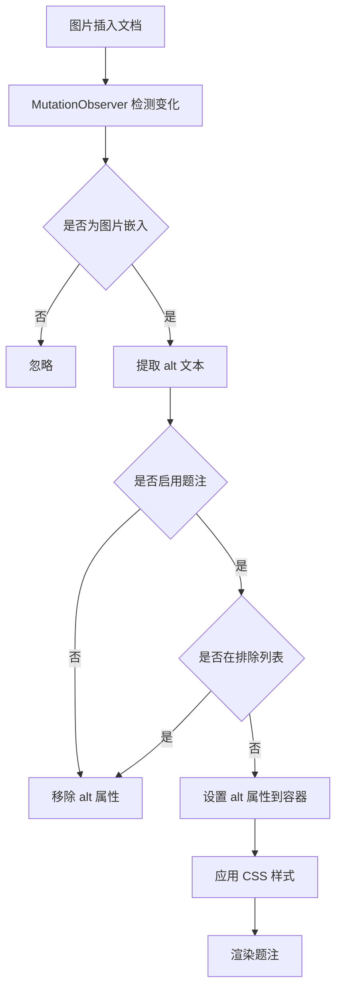

#### 2.1.4 粘贴/拖放处理流程

Converter 当前的处理流程:

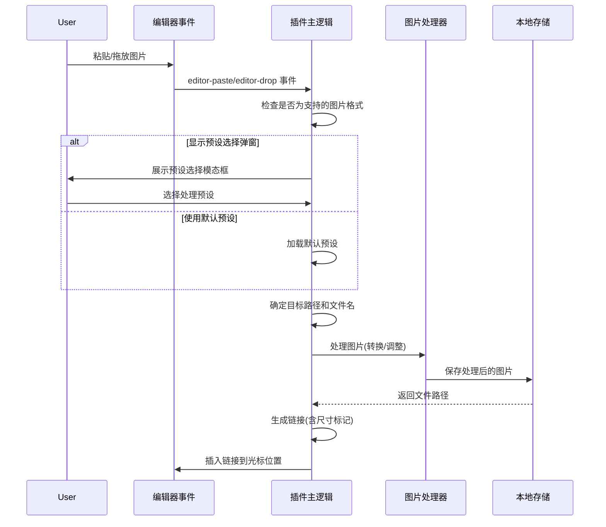

### 2.2 Upload 插件核心功能

#### 2.2.1 上传能力

| 功能 | 实现位置 | 描述 |
|------|---------|------|
| 剪贴板上传 | main.ts | 粘贴图片时自动上传 |
| 拖放上传 | main.ts | 拖放图片时自动上传 |
| 批量上传 | main.ts | 上传当前文档所有图片 |
| PicGo 集成 | uploader/picgo.ts | 通过 PicGo/PicList 服务上传 |

#### 2.2.2 链接替换机制

Upload 插件的链接处理:

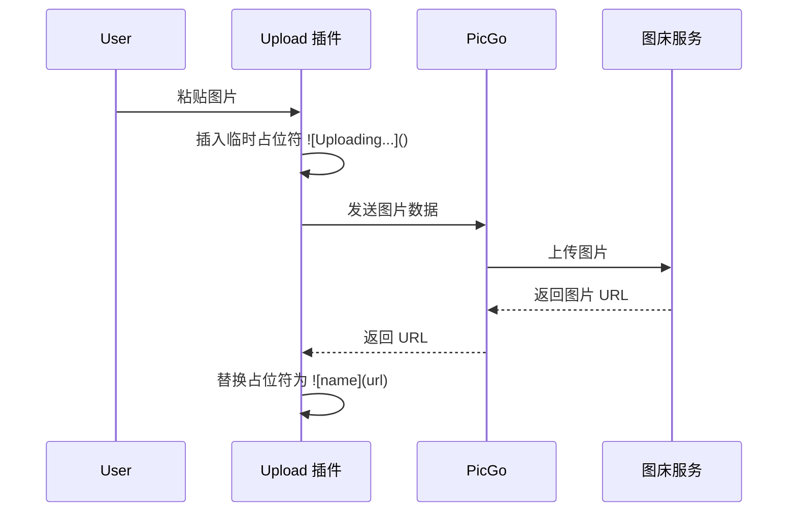

关键问题:
- Upload 插件生成的链接格式固定为 ``
- 不支持在 `[]` 中插入尺寸标记
- imageDesc 设置控制 alt 内容(origin/none/removeDefault)
- imageSizeSuffix 设置可添加后缀,但不是标准尺寸标记格式

### 2.3 功能对比表

| 功能 | Converter 插件 | Upload 插件 | 整合后目标 |
|------|---------------|-------------|-----------||
| 图片格式转换 | ✓ | ✗ | 本地模式保留,图床模式不处理(由 PicList 负责) |
| 尺寸调整 | ✓ | ✗ | 本地模式保留,图床模式不处理(由 PicList 负责) |
| 非破坏性尺寸标记 | ✓ | ✗ | **两种模式都支持** |
| 题注渲染 | ✓ | ✗ | **两种模式都支持** |
| 图床上传 | ✗ | ✓ | 图床模式启用 |
| 上传后删除本地 | ✗ | ✓ | 图床模式可配置 |
| 本地存储 | ✓ | ✗ | 本地模式启用 |
| 批量处理 | ✓ | ✓ | 两种模式都支持 |

## 3. 整合方案设计

### 3.1 架构设计

#### 3.1.1 整体架构

整合后的插件将采用**策略模式**,通过粘贴处理模式开关选择不同的处理策略:

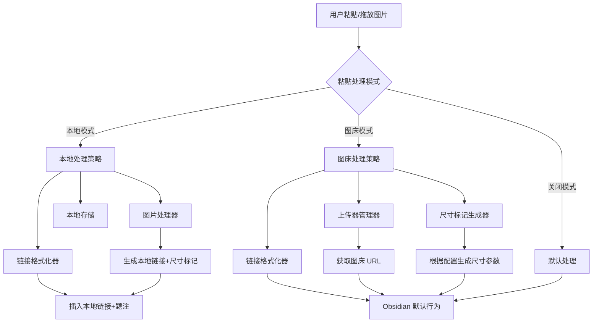

#### 3.1.2 模式切换设置

设置项设计:

| 设置名称 | 类型 | 可选值 | 默认值 | 描述 |
|---------|------|-------|--------|------|
| pasteHandlingMode | 下拉选择 | local / cloud / disabled | local | 粘贴/拖放图片的处理模式 |

### 3.2 粘贴/拖放事件处理流程

#### 3.2.1 本地模式流程

本地模式保持 Converter 原有逻辑不变:

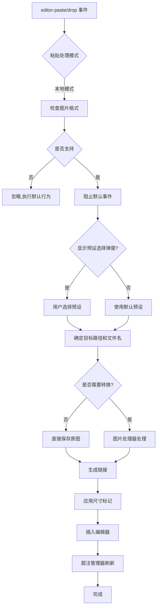

#### 3.2.2 图床模式流程

图床模式直接上传原图并保留题注和尺寸标记:

```mermaid
flowchart TD
    A[editor-paste/drop 事件] --> B{粘贴处理模式}
    B -->|图床模式| C[检查图片格式]
    C --> D{是否支持}
    D -->|否| E[忽略,执行默认行为]
    D -->|是| F[阻止默认事件]
    F --> G[插入临时占位符]
    G --> H[提取原图尺寸信息]
    H --> I[上传器管理器上传原图]
    I --> J{上传是否成功?}
    J -->|失败| K[显示错误,保留占位符]
    J -->|成功| L[获取图床 URL]
    L --> M{是否配置了尺寸标记?}
    M -->|是| N[根据设置生成尺寸参数]
    M -->|否| O[不添加尺寸参数]
    N --> P[生成链接: ]
    O --> Q[生成链接: ]
    P --> R[替换占位符]
    Q --> R
    R --> S{是否删除本地文件?}
    S -->|是| T[删除本地临时文件]
    S -->|否| U[保留本地文件]
    T --> V[题注管理器刷新]
    U --> V
    V --> W[完成]
```

#### 3.2.3 关闭模式流程

关闭模式不进行任何拦截,完全遵循 Obsidian 默认行为:

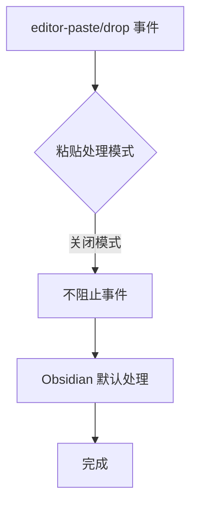

### 3.3 链接格式化增强

#### 3.3.1 图床链接的尺寸标记支持

核心挑战: Markdown 格式 `` 需要将尺寸标记插入到 `[]` 中

方案设计:

| 链接类型 | 原格式 | 增强后格式 | 说明 |
|---------|-------|-----------|------|
| Wikilink | `![[image.jpg]]` | `![[image.jpg\|300x200]]` | Converter 已支持 |
| Markdown | `` | `` | **新增支持,alt 为空格** |

图床模式尺寸标记生成规则:

| 配置项 | 值 | 生成的尺寸标记 | 最终链接示例 |
|-------|---|--------------|-------------|
| imageSizeWidth | 未设置 | 无 | `` |
| imageSizeWidth | 300 | `\|300x` | `` |
| imageSizeWidth + imageSizeHeight | 300, 200 | `\|300x200` | `` |
| imageSizeHeight | 200 | `\|x200` | `` |

#### 3.3.2 题注功能独立性

**设计原则**: 题注功能完全独立,不与粘贴模式耦合

| 方面 | 实现方式 |
|------|----------|
| ImageCaptionManager | 保持原有实现,不修改核心逻辑 |
| 题注渲染逻辑 | 基于 alt 属性渲染,与图片来源无关 |
| 配置项 | enableImageCaptions 等所有题注设置保持不变 |
| DOM 监听 | MutationObserver 监听所有图片,不区分本地/图床 |

**Alt 文本处理**:

| 粘贴模式 | Alt 文本来源 | 题注行为 |
|---------|-------------|----------|
| 本地模式 | Converter 原有逻辑(文件名/用户输入) | ImageCaptionManager 正常渲染 |
| 图床模式 | 固定为空格 ` ` | ImageCaptionManager 正常渲染(空格被 CSS 隐藏) |
| 关闭模式 | Obsidian 默认行为 | ImageCaptionManager 正常渲染 |

**说明**: 图床模式使用空格作为 alt,利用 CSS `:empty` 或空白字符处理自然隐藏题注,无需修改 ImageCaptionManager 代码

### 3.4 模块职责划分

#### 3.4.1 新增模块

| 模块名称 | 职责 | 依赖 |
|---------|------|------|
| PasteHandlingStrategyManager | 根据模式选择和分发处理策略 | ImageProcessor, UploaderManager, CloudLinkFormatter |
| CloudLinkFormatter | 专门处理图床链接的格式化(含尺寸标记),alt 固定为空格 | 无 |
| CloudUploadSettings | 图床模式专属设置(继承自 Upload 插件配置) | 无 |

#### 3.4.2 现有模块扩展

| 模块 | 扩展内容 |
|------|---------||
| ImageConverterSettings | 添加粘贴处理模式设置项,集成 CloudUploadSettings |
| main.ts (Converter) | 在 dropPasteRegisterEvents 方法中添加模式判断分支 |
| ImageCaptionManager | **保持原有实现不变**,仅依赖现有 CSS 处理空白 alt |

### 3.5 数据流设计

#### 3.5.1 本地模式数据流

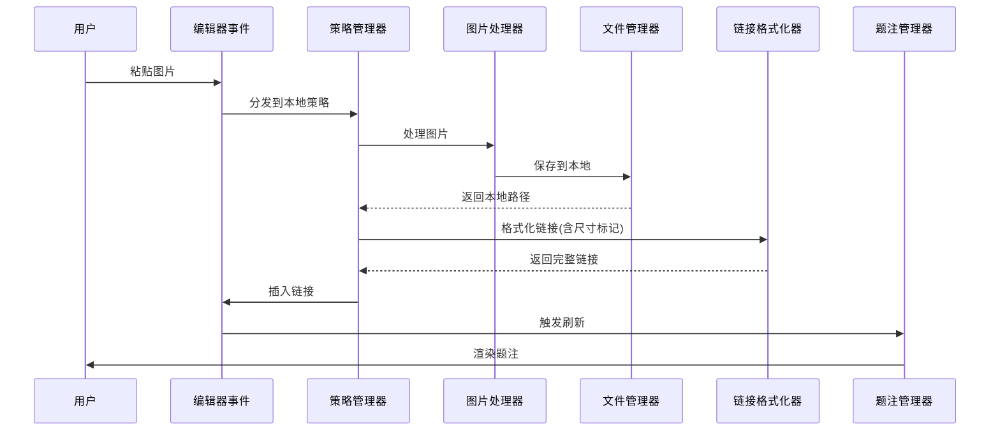

#### 3.5.2 图床模式数据流

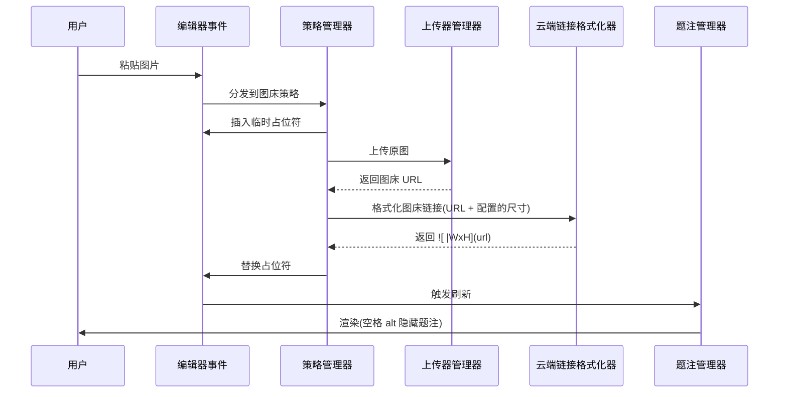

## 4. 关键技术实现要点

### 4.1 图床链接尺寸标记注入

**挑战**: Markdown 格式 `` 中,标准语法不支持在 `[]` 中添加额外参数

**解决方案**:

采用扩展 Markdown 语法,利用 `|` 分隔符在空格 alt 后追加尺寸信息:

```
标准格式: 
扩展格式: 
```

实现策略:

| 步骤 | 操作 | 示例 |
|------|------|------|
| 1. 读取配置 | 从图床设置获取尺寸配置 | imageSizeWidth: 300, imageSizeHeight: 200 |
| 2. 生成参数 | 格式化为字符串 | `\|300x200` |
| 3. 固定 alt | alt 固定为空格 | ` ` |
| 4. 拼接链接 | 组装完整 Markdown 链接 | `` |

**说明**:
- 图床模式不提取原图尺寸,完全依赖用户配置
- alt 固定为空格是为了让 ImageCaptionManager 识别并隐藏题注
- 如果用户未配置尺寸,生成 `` 不带尺寸标记

### 4.2 题注功能独立性保障

**设计原则**: 题注功能保持完全独立,不修改 ImageCaptionManager 核心逻辑

**当前 ImageCaptionManager 工作机制**:

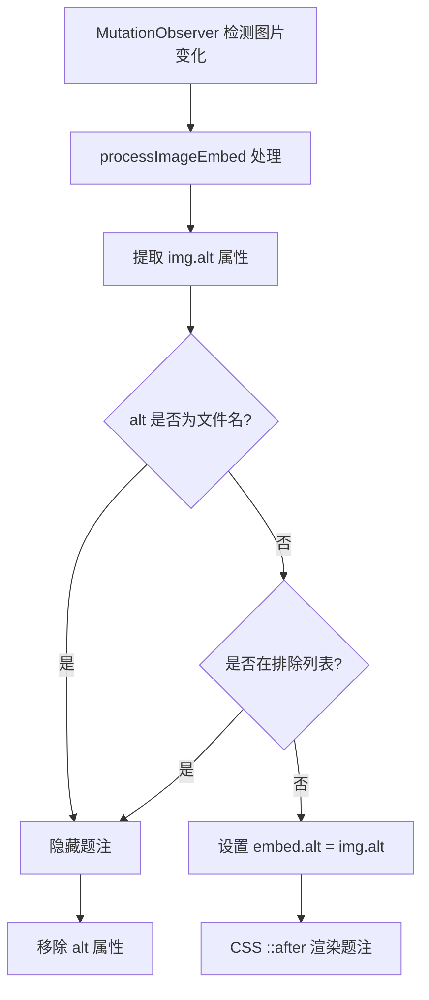

**图床模式下的题注处理**:

| 场景 | Alt 值 | ImageCaptionManager 行为 | CSS 渲染结果 |
|------|--------|------------------------|-------------|
| 无尺寸标记 | ` ` (空格) | 设置 embed.alt=" " | CSS content: attr(alt) 显示空白,视觉上无题注 |
| 有尺寸标记 | ` \|300x200` | 设置 embed.alt=" \|300x200" | CSS 显示 " \|300x200",需解析 |

**尺寸标记解析方案**:

在 **LinkFormatter** 或 **CloudLinkFormatter** 中处理,而非修改 ImageCaptionManager:

- 生成链接时: `` (alt 留空,尺寸放在 alt 位置)
- ImageCaptionManager 读取时会获取到 `|300x200`
- 可选: 在 ImageCaptionManager 的 CSS 中添加规则处理 `|` 开头的 alt,或者在生成时完全省略 alt 仅在 Obsidian 渲染层添加尺寸

**最佳实践**: 
- **不修改 ImageCaptionManager**
- 图床模式生成链接格式: `` 或 ``,alt 为空或仅包含尺寸标记
- 依赖 Obsidian 原生 Markdown 解析 `|WxH` 语法来设置图片显示尺寸
- 题注功能完全由 enableImageCaptions 设置控制,与粘贴模式无关

### 4.3 代码集成策略

**基础**: 在 Converter 插件代码库上集成 Upload 插件的上传功能

**需要集成的 Upload 模块**:

| Upload 模块 | 路径 | 用途 | 集成方式 |
|------------|------|------|----------|
| UploaderManager | uploader/index.ts | 上传器管理 | 复制到 Converter 的 src/uploader/ |
| PicGoUploader | uploader/picgo.ts | PicGo 上传器 | 复制到 Converter 的 src/uploader/ |
| PicGoCoreUploader | uploader/picgoCore.ts | PicGo-Core 上传器 | 复制到 Converter 的 src/uploader/ |
| 类型定义 | uploader/types.ts | 上传相关类型 | 复制到 Converter 的 src/uploader/ |
| Helper 工具 | helper.ts | 辅助函数 | 选择性集成到 Converter 现有 utils |

**Converter 需要修改的文件**:

| 文件 | 修改内容 |
|------|----------|
| main.ts | 在 dropPasteRegisterEvents 中添加模式判断,图床模式调用上传流程 |
| ImageConverterSettings.ts | 添加 pasteHandlingMode 和 cloudUploadSettings |
| 新增: CloudLinkFormatter.ts | 专门处理图床链接生成(带尺寸标记) |

**不需要修改的 Converter 模块**:

- ✅ ImageCaptionManager.ts - 保持原样
- ✅ ImageProcessor.ts - 保持原样  
- ✅ LinkFormatter.ts - 保持原样(本地模式使用)
- ✅ BatchImageProcessor.ts - 保持原样
- ✅ 所有其他处理模块 - 保持原样

**集成流程**:

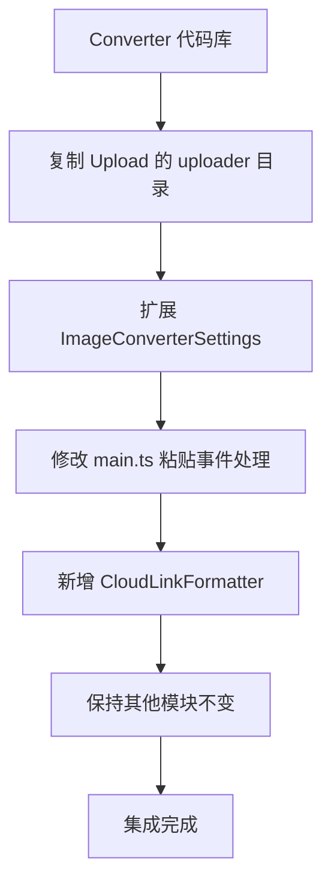

**职责分离**:

| 职责 | 负责方 |
|------|--------|
| 图片处理(转换/压缩/调整) | PicList(图床模式) / ImageProcessor(本地模式) |
| 图片上传 | UploaderManager(图床模式) |
| 链接生成 | CloudLinkFormatter(图床模式) / LinkFormatter(本地模式) |
| 题注渲染 | ImageCaptionManager(两种模式共用,保持独立) |
| 文件管理 | FolderAndFilenameManagement(本地模式) |

### 4.4 兼容性与错误处理

#### 4.4.1 上传失败处理

| 场景 | 处理策略 |
|------|---------|
| 网络错误 | 显示错误通知,保留占位符或回退到本地模式 |
| 图床配置错误 | 提示用户检查设置,提供设置页面快捷入口 |
| 超时 | 可配置超时时间,超时后取消并通知 |

#### 4.4.2 降级策略

当图床模式不可用时的回退机制:

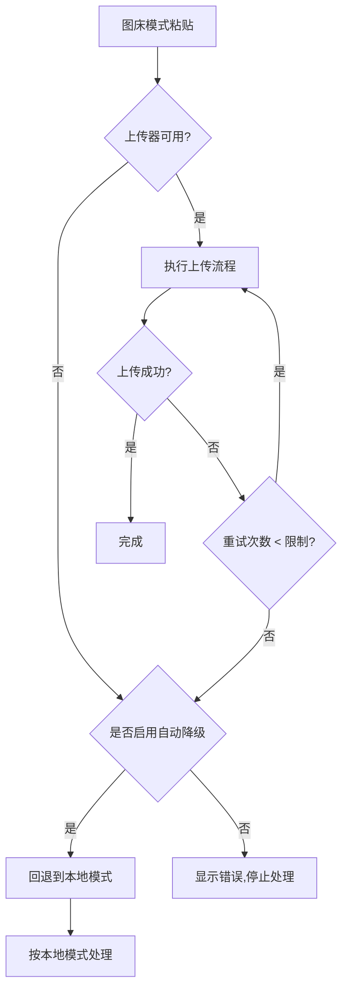

## 5. 用户界面设计

### 5.1 设置页面布局

设置页面采用分组设计,清晰区分不同功能模块:

#### 5.1.1 设置分组结构

```
┌─────────────────────────────────────┐
│  粘贴处理设置                         │
│  └─ 粘贴处理模式 [下拉: 本地/图床/关闭]│
├─────────────────────────────────────┤
│  图床配置(仅在图床模式下显示)         │
│  ├─ 上传器类型 [PicGo/PicGo-Core]    │
│  ├─ PicGo 服务器地址                 │
│  ├─ PicList 删除服务器地址           │
│  ├─ 远程服务器模式 [开关]             │
│  ├─ 图片尺寸设置                     │
│  │   ├─ 宽度 [数字输入]               │
│  │   └─ 高度 [数字输入]               │
│  ├─ 应用网络图片 [开关]               │
│  ├─ 网络图片域名黑名单 [文本域]       │
│  ├─ 剪贴板包含文本和图片时上传 [开关] │
│  └─ 上传后删除本地源文件 [开关]       │
├─────────────────────────────────────┤
│  图片处理预设(继承自 Converter)       │
│  ├─ 转换预设管理                     │
│  ├─ 文件名预设管理                   │
│  ├─ 文件夹预设管理                   │
│  ├─ 链接格式预设管理                 │
│  └─ 尺寸标记预设管理                 │
├─────────────────────────────────────┤
│  题注设置(继承自 Converter)           │
│  ├─ 启用图片题注 [开关]               │
│  ├─ 题注样式配置                     │
│  └─ 排除扩展名列表                   │
└─────────────────────────────────────┘
```

#### 5.1.2 关键设置项说明

**粘贴处理模式**

- UI 组件: 下拉选择框
- 选项:
  - 本地模式: 处理后保存到本地
  - 图床模式: 直接上传到图床
  - 关闭: 不处理,使用 Obsidian 默认行为
- 默认值: 本地模式
- 提示文本: "选择粘贴/拖放图片时的处理方式"

**图床模式配置项** (仅当模式为"图床"时显示)

| 设置项 | 类型 | 默认 | 说明 |
|-------|------|------|------|
| 上传器类型 | 下拉 | PicGo | PicGo 或 PicGo-Core |
| PicGo 服务器地址 | 文本 | http://127.0.0.1:36677/upload | PicGo/PicList 上传接口 |
| PicList 删除服务器地址 | 文本 | http://127.0.0.1:36677/delete | PicList 删除接口 |
| PicGo-Core 路径 | 文本 | (空) | PicGo-Core 可执行文件路径 |
| 远程服务器模式 | 开关 | 关闭 | 是否使用远程 PicGo 服务 |
| 图片宽度 | 数字 | (空) | 链接中显示的宽度,留空则不限制 |
| 图片高度 | 数字 | (空) | 链接中显示的高度,留空则不限制 |
| 应用网络图片 | 开关 | 关闭 | 是否也上传网络图片 |
| 网络图片域名黑名单 | 文本域 | (空) | 不上传的域名列表,每行一个 |
| 剪贴板包含文本和图片时上传 | 开关 | 开启 | 如 Excel 复制时同时有文本和图片 |
| 上传后删除本地源文件 | 开关 | 关闭 | 上传成功后是否删除本地文件 |

### 5.2 用户交互流程

#### 5.2.1 模式切换流程

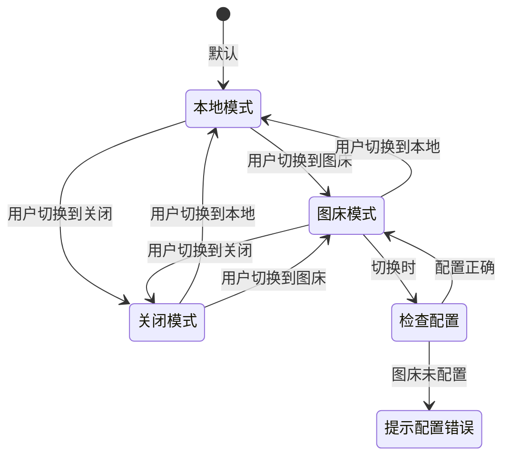

#### 5.2.2 粘贴时的用户体验

**本地模式**:
1. 粘贴图片
2. (可选)弹出预设选择对话框
3. 图片处理(用户可见进度)
4. 链接插入(带尺寸标记)
5. 题注自动渲染

**图床模式**:
1. 粘贴图片
2. 立即插入临时占位符 ``
3. (可选)图片预处理
4. 后台上传(用户可见上传进度)
5. 上传成功后替换占位符为正式链接(带尺寸标记)
6. 题注自动渲染

**关闭模式**:
1. 粘贴图片
2. Obsidian 默认行为(无插件干预)

### 5.3 通知与反馈

#### 5.3.1 通知设计原则

- 成功操作: 简短提示,不打断用户
- 警告信息: 明确说明原因和建议操作
- 错误信息: 详细描述问题,提供解决方案链接

#### 5.3.2 通知消息表

| 场景 | 消息类型 | 消息内容 | 持续时间 |
|------|---------|---------|---------|
| 本地处理成功 | 成功 | "图片已处理并保存" | 2秒 |
| 上传成功 | 成功 | "图片已上传到图床" | 2秒 |
| 上传中 | 信息 | "正在上传图片..." | 直到完成 |
| 上传失败 | 错误 | "上传失败: [原因]。点击查看设置" | 5秒 |
| 图床未配置 | 警告 | "图床模式需要先配置 PicGo 服务" | 5秒 |
| 降级到本地 | 警告 | "上传失败,已保存到本地" | 3秒 |

## 6. 配置与兼容性

### 6.1 默认配置

初始化时的默认配置值:

```
粘贴处理设置:
├─ pasteHandlingMode: "local"

图床配置(继承 Upload 插件默认值):
├─ uploader: "PicGo"
├─ uploadServer: "http://127.0.0.1:36677/upload"
├─ deleteServer: "http://127.0.0.1:36677/delete"
├─ remoteServerMode: false
├─ imageSizeWidth: undefined
├─ imageSizeHeight: undefined
├─ workOnNetWork: false
├─ newWorkBlackDomains: ""
├─ applyImage: true
└─ deleteSource: false

图片处理配置(继承 Converter 插件默认值):
├─ outputFormat: "jpeg"
├─ quality: 90
├─ enableImageCaptions: true
└─ ... (其他 Converter 默认值)
```

### 6.2 向后兼容性

#### 6.2.1 现有用户迁移

对于已安装 Converter 插件的用户:

| 原有配置 | 迁移后 | 说明 |
|---------|-------|------|
| 所有 Converter 设置 | 完整保留 | 无缝继承 |
| 粘贴/拖放行为 | 默认"本地模式" | 保持原有体验 |
| 新增设置 | 使用默认值 | 不影响现有功能 |

#### 6.2.2 配置数据结构

配置数据采用扩展设计,确保向后兼容:

```
ImageConverterSettings (原有) 
  + pasteHandlingMode: PasteMode (新增)
  + cloudUploadSettings: CloudUploadSettings (新增)
    ├─ uploader: string
    ├─ uploadServer: string
    ├─ deleteServer: string
    ├─ picgoCorePath: string
    ├─ remoteServerMode: boolean
    ├─ imageSizeWidth: number | undefined
    ├─ imageSizeHeight: number | undefined
    ├─ workOnNetWork: boolean
    ├─ newWorkBlackDomains: string
    ├─ applyImage: boolean
    └─ deleteSource: boolean
```

### 6.3 插件依赖

#### 6.3.1 必需依赖

| 依赖项 | 类型 | 用途 |
|-------|------|------|
| Obsidian API | 运行时 | 插件基础框架 |
| PicGo / PicList | 外部服务 | 图床上传(仅图床模式需要) |

#### 6.3.2 可选依赖

| 依赖项 | 用途 | 不可用时的影响 |
|-------|------|---------------|
| PicGo 服务 | 图床上传 | 图床模式不可用,可降级到本地 |
| 网络连接 | 图床上传 | 上传失败,触发降级或错误提示 |

### 6.4 性能考量

#### 6.4.1 性能关键点

| 操作 | 性能影响 | 优化策略 |
|------|---------|---------|
| 图片处理 | CPU 密集 | 异步处理,显示进度 |
| 图床上传 | 网络 I/O | 超时控制,并发限制 |
| 题注渲染 | DOM 操作 | 防抖机制,仅处理可见区域 |
| 大图处理 | 内存占用 | 流式处理,及时释放 buffer |

#### 6.4.2 性能基准目标

| 场景 | 目标响应时间 |
|------|------------|
| 本地模式粘贴(小图 < 1MB) | < 500ms |
| 本地模式粘贴(大图 > 5MB) | < 2s |
| 图床模式上传(小图 < 1MB) | < 3s |
| 图床模式上传(大图 > 5MB) | < 10s |
| 题注渲染刷新 | < 100ms |

## 7. 测试策略

### 7.1 功能测试点

#### 7.1.1 核心功能测试

| 测试场景 | 前置条件 | 预期结果 |
|---------|---------|---------|
| 本地模式粘贴图片 | 模式设为"本地" | 图片处理后保存到本地,插入含尺寸标记的链接 |
| 图床模式粘贴图片 | 模式设为"图床",PicGo 已配置 | 图片上传到图床,插入含尺寸标记的图床链接 |
| 关闭模式粘贴图片 | 模式设为"关闭" | Obsidian 默认行为,无插件干预 |
| 题注渲染(本地) | 启用题注,本地模式粘贴 | alt 文本显示为题注 |
| 题注渲染(图床) | 启用题注,图床模式粘贴 | alt 文本显示为题注 |
| 尺寸标记解析 | 插入含 `\|300x200` 的链接 | 图片按指定尺寸显示 |

#### 7.1.2 边界条件测试

| 测试场景 | 预期结果 |
|---------|---------|
| 图床模式但 PicGo 未配置 | 显示警告,提示配置图床 |
| 图床模式上传失败 | 显示错误,根据设置降级或保留占位符 |
| 粘贴非图片文件 | 忽略,执行默认行为 |
| 粘贴超大图片(> 50MB) | 显示处理进度,不阻塞 UI |
| 同时粘贴多张图片 | 逐个处理,显示队列进度 |

### 7.2 兼容性测试

#### 7.2.1 跨平台测试

| 平台 | 测试要点 |
|------|---------|
| Windows | PicGo 服务连接,本地路径处理 |
| macOS | PicGo 服务连接,本地路径处理 |
| Linux | PicGo 服务连接,本地路径处理 |

#### 7.2.2 Obsidian 版本兼容性

| Obsidian 版本 | 兼容性目标 |
|--------------|-----------|
| 最新稳定版 | 完全兼容 |
| 近 3 个主版本 | 兼容测试 |
| 旧版本 | 尽力兼容,不保证 |

### 7.3 性能测试

#### 7.3.1 性能测试场景

| 场景 | 测试数据 | 验收标准 |
|------|---------|---------|
| 本地模式处理小图 | 100 张 < 1MB 图片 | 平均 < 500ms/张 |
| 本地模式处理大图 | 10 张 > 5MB 图片 | 平均 < 2s/张 |
| 图床模式上传小图 | 50 张 < 1MB 图片 | 平均 < 3s/张 |
| 图床模式上传大图 | 5 张 > 5MB 图片 | 平均 < 10s/张 |
| 题注渲染 | 包含 100 张图片的笔记 | 打开 < 1s |

### 7.4 用户体验测试

#### 7.4.1 用户流程测试

| 测试点 | 验收标准 |
|-------|---------|
| 首次安装配置 | 默认设置可用,无需立即配置 |
| 模式切换 | 切换后立即生效,无需重启 |
| 错误提示 | 清晰易懂,提供解决方案 |
| 进度反馈 | 长时操作有明确进度提示 |

## 8. 实施路径

### 8.1 开发阶段划分

#### 8.1.1 阶段一: 基础整合

**目标**: 完成两个插件代码的初步整合,建立统一架构

**任务清单**:

| 任务 | 优先级 | 预计工作量 |
|------|-------|-----------|
| 合并代码库 | 高 | 1 天 |
| 统一设置数据结构 | 高 | 1 天 |
| 实现粘贴处理策略管理器 | 高 | 2 天 |
| 保留 Converter 所有现有功能 | 高 | 1 天 |
| 保留 Upload 所有现有功能 | 高 | 1 天 |

**验收标准**:
- 原 Converter 所有功能正常工作
- 原 Upload 所有功能正常工作
- 可通过设置切换粘贴处理模式(但功能尚未完全实现)

#### 8.1.2 阶段二: 图床模式实现

**目标**: 完成图床模式的核心功能,支持尺寸标记和题注

**任务清单**:

| 任务 | 优先级 | 预计工作量 |
|------|-------|-----------||
| 实现图床链接尺寸标记注入(基于配置) | 高 | 1 天 |
| 新增 CloudLinkFormatter 处理图床链接格式 | 高 | 1 天 |
| 实现图床模式粘贴/拖放流程(原图直接上传) | 高 | 2 天 |
| 实现临时占位符机制 | 中 | 1 天 |
| 集成 Upload 插件所有配置项 | 高 | 1 天 |
| 实现上传后删除本地文件 | 中 | 0.5 天 |

**验收标准**:
- 图床模式粘贴图片,上传成功并插入带尺寸标记的链接
- 题注功能保持独立,不受粘贴模式影响
- 上传失败时有明确错误提示
- Upload 插件所有配置项正常工作

#### 8.1.3 阶段三: 高级功能与优化

**目标**: 完善用户体验,优化性能,增加可配置性

**任务清单**:

| 任务 | 优先级 | 预计工作量 |
|------|-------|-----------||
| 实现上传进度显示 | 中 | 1 天 |
| 实现批量上传优化 | 中 | 2 天 |
| 完善设置页面 UI | 中 | 1 天 |
| 实现网络图片上传功能 | 中 | 1 天 |
| 实现域名黑名单过滤 | 低 | 0.5 天 |
| 性能优化(异步处理、内存管理) | 中 | 1 天 |
| 错误处理与日志记录 | 低 | 1 天 |

**验收标准**:
- 上传过程有清晰进度反馈
- 批量操作不阻塞 UI
- 所有配置项可在设置页面调整
- 网络图片上传和黑名单功能正常
- 性能达到基准目标

#### 8.1.4 阶段四: 测试与文档

**目标**: 全面测试,编写文档,准备发布

**任务清单**:

| 任务 | 优先级 | 预计工作量 |
|------|-------|-----------|
| 单元测试编写 | 高 | 3 天 |
| 集成测试 | 高 | 2 天 |
| 跨平台兼容性测试 | 高 | 2 天 |
| 性能测试 | 中 | 1 天 |
| 用户文档编写 | 高 | 2 天 |
| API 文档编写 | 低 | 1 天 |
| 示例与教程 | 中 | 1 天 |

**验收标准**:
- 所有测试场景通过
- 文档完整且易懂
- 准备好发布版本

### 8.2 风险与应对

#### 8.2.1 技术风险

| 风险 | 影响 | 概率 | 应对策略 |
|------|------|------|---------|
| Markdown 尺寸标记解析不兼容 | 高 | 中 | 提供 Wikilink 格式作为备选方案 |
| 图床 API 变更 | 中 | 低 | 抽象上传器接口,易于适配 |
| 性能问题(大图处理) | 中 | 中 | 实现流式处理和进度反馈 |
| Obsidian API 变更 | 高 | 低 | 跟踪官方更新,及时适配 |

#### 8.2.2 用户体验风险

| 风险 | 影响 | 概率 | 应对策略 |
|------|------|------|---------|
| 配置复杂性增加 | 中 | 高 | 提供合理默认值,分步配置向导 |
| 功能冲突或混淆 | 中 | 中 | 清晰的模式划分和文档说明 |
| 迁移成本 | 低 | 低 | 完全向后兼容,无需手动迁移 |

### 8.3 发布计划

#### 8.3.1 版本规划

| 版本 | 功能范围 | 发布时间 |
|------|---------|---------|
| v1.0.0-alpha | 阶段一完成,基础整合 | 开发开始后 1 周 |
| v1.0.0-beta | 阶段二完成,图床模式核心功能 | 开发开始后 3 周 |
| v1.0.0-rc | 阶段三完成,所有功能与优化 | 开发开始后 5 周 |
| v1.0.0 | 正式版,通过测试 | 开发开始后 7 周 |

#### 8.3.2 发布检查清单

**代码质量**:
- [ ] 所有单元测试通过
- [ ] 集成测试通过
- [ ] 代码审查完成
- [ ] 无已知关键 bug

**文档**:
- [ ] README 完整
- [ ] 用户使用指南
- [ ] 配置说明
- [ ] 常见问题 FAQ
- [ ] 更新日志

**兼容性**:
- [ ] Windows 测试通过
- [ ] macOS 测试通过
- [ ] Linux 测试通过
- [ ] 最新稳定版 Obsidian 兼容

**用户体验**:
- [ ] 默认配置可用
- [ ] 错误提示清晰
- [ ] 性能达标
- [ ] 无明显 UI 问题

## 9. 后续演进方向

### 9.1 短期优化(v1.1 - v1.3)

| 功能 | 价值 | 复杂度 |
|------|------|-------|
| 支持更多图床服务(Cloudinary, Imgur 等) | 中 | 中 |
| 图片水印功能 | 低 | 中 |
| 图片 EXIF 元数据保留/移除 | 低 | 低 |
| 拖放时显示预览 | 中 | 低 |
| 批量上传进度优化 | 中 | 中 |

### 9.2 中期扩展(v2.0+)

| 功能 | 价值 | 复杂度 |
|------|------|-------|
| 智能图片优化(AI 压缩) | 高 | 高 |
| 图床迁移工具 | 中 | 中 |
| 图片版本管理 | 中 | 高 |
| 协作模式(团队共享图床) | 高 | 高 |
| 离线缓存机制 | 中 | 中 |

### 9.3 长期愿景

打造 Obsidian 生态中最强大的图片管理解决方案:

- **统一管理**: 本地图片、图床图片、网络图片的统一管理界面
- **智能优化**: 基于使用场景自动选择最优处理策略
- **无缝集成**: 与其他 Obsidian 插件(如发布、同步)深度集成
- **开放生态**: 提供 API 供其他插件调用图片处理能力

## 10. 代码修改清单

### 10.1 需要新增的文件

| 文件路径 | 来源 | 说明 |
|---------|------|------|
| src/uploader/index.ts | Upload 插件 | UploaderManager 上传器管理 |
| src/uploader/picgo.ts | Upload 插件 | PicGo 上传器实现 |
| src/uploader/picgoCore.ts | Upload 插件 | PicGo-Core 上传器实现 |
| src/uploader/types.ts | Upload 插件 | 上传相关类型定义 |
| src/CloudLinkFormatter.ts | 新建 | 图床链接格式化器 |

### 10.2 需要修改的文件

#### main.ts

**修改位置**: `dropPasteRegisterEvents()` 方法

**修改内容**:
- 在处理粘贴/拖放事件时,根据 `pasteHandlingMode` 分支
- 如果是 `cloud` 模式,调用上传流程而非本地处理流程
- 保持原有本地模式逻辑完全不变

**伪代码**:
```
if (this.settings.pasteHandlingMode === 'cloud') {
    // 调用图床上传流程
    await this.handleCloudUpload(file, editor, cursor);
} else if (this.settings.pasteHandlingMode === 'local') {
    // 原有本地处理流程(保持不变)
    await this.handleDrop/handlePaste(...); // 现有代码
} else {
    // disabled 模式,不处理
    return;
}
```

#### ImageConverterSettings.ts

**修改内容**:
- 添加 `pasteHandlingMode: 'local' | 'cloud' | 'disabled'` 字段
- 添加 `cloudUploadSettings: CloudUploadSettings` 对象
- 在设置 UI 中添加粘贴模式选择下拉框
- 当模式为 `cloud` 时,显示图床配置区域

### 10.3 保持不变的文件

以下文件**完全不需要修改**,保持 Converter 原有功能:

- ✅ ImageCaptionManager.ts - 题注管理器
- ✅ ImageProcessor.ts - 图片处理器
- ✅ LinkFormatter.ts - 本地链接格式化器
- ✅ FolderAndFilenameManagement.ts - 文件管理
- ✅ BatchImageProcessor.ts - 批量处理
- ✅ VariableProcessor.ts - 变量处理
- ✅ ImageAlignment.ts / ImageAlignmentManager.ts - 对齐管理
- ✅ ImageResizer.ts - 尺寸调整
- ✅ ContextMenu.ts - 右键菜单
- ✅ 所有 Modal 文件 - 弹窗
- ✅ 所有其他工具类

### 10.4 集成步骤

1. **阶段一: 复制 Upload 模块**
   - 从 Upload 插件复制 `uploader/` 目录到 Converter
   - 从 Upload 插件复制 `helper.ts` 的必要工具函数

2. **阶段二: 扩展设置**
   - 修改 `ImageConverterSettings.ts` 添加新设置项
   - 更新设置 UI

3. **阶段三: 添加上传流程**
   - 新建 `CloudLinkFormatter.ts`
   - 在 `main.ts` 添加 `handleCloudUpload()` 方法
   - 修改 `dropPasteRegisterEvents()` 添加模式分支

4. **阶段四: 测试验证**
   - 测试本地模式(确保原功能不受影响)
   - 测试图床模式
   - 测试题注功能(确保两种模式都正常)

## 11. 附录

### 11.1 术语表

| 术语 | 定义 |
|------|------|
| 粘贴处理模式 | 控制粘贴/拖放图片时插件的处理方式,包括本地、图床、关闭三种 |
| 非破坏性尺寸标记 | 在链接中添加尺寸参数而不修改原始图片文件的技术 |
| 题注渲染 | 基于图片 alt 文本自动生成可视化图片说明的功能 |
| 预设 | 预先配置的一组图片处理参数(格式、质量、尺寸等) |
| 图床 | 在线图片存储服务,提供图片外链功能 |
| 降级策略 | 当首选方式不可用时,自动切换到备选方式的机制 |

### 11.2 参考资源

**相关项目**:
- obsidian-image-converter: https://github.com/xRyul/obsidian-image-converter
- obsidian-image-auto-upload-plugin: https://github.com/renmu123/obsidian-image-auto-upload-plugin
- PicGo: https://github.com/Molunerfinn/PicGo
- PicList: https://github.com/Kuingsmile/PicList

**技术文档**:
- Obsidian API 文档: https://docs.obsidian.md/
- CodeMirror 6 文档: https://codemirror.net/
- Markdown 规范: https://spec.commonmark.org/

### 11.3 配置示例

#### 10.3.1 典型用例配置

**用例 1: 博客写作者(优先图床)**

```
粘贴处理模式: 图床模式
图片宽度: 800
图片高度: (留空,自动按比例)
上传后删除本地: 开启
启用题注: 关闭(空格 alt 自动隐藏)

PicList 配置(在 PicList 中设置):
  - 输出格式: WebP
  - 质量: 85
  - 最大尺寸: 1200px
```

**用例 2: 笔记整理者(优先本地)**

```
粘贴处理模式: 本地模式
输出格式: JPEG
质量: 90
尺寸调整: 按编辑器宽度
启用题注: 开启
```

**用例 3: 临时关闭自动处理**

```
粘贴处理模式: 关闭模式
(其他设置保留,但不生效)
```

---

**设计文档版本**: v1.0  
**最后更新**: 2024年  
**信心评估**: 中等  
**信心基础**: 两个插件的架构已明确,核心功能整合方案可行,但图床链接尺寸标记的 Markdown 解析兼容性需要实际测试验证
